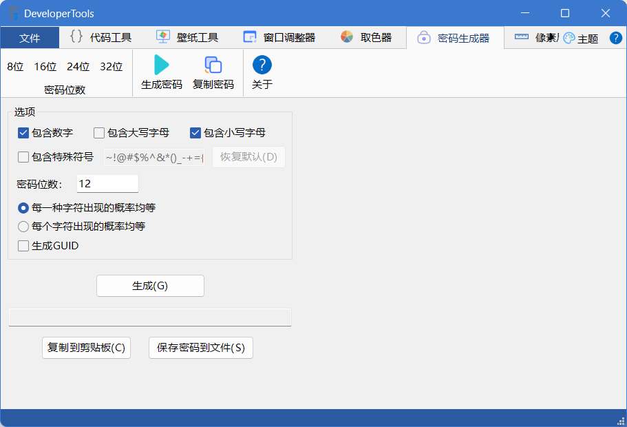

# DeveloperTools
一些小工具集合。

使用 Visual Studio 2022 + Qt VS Tools 开发，Qt 版本：5.15.2。

支持模块扩展。

目前集成了以下模块：

| 模块名        | 语言 | 使用的框架 |
| ------------- | ---- | ---------- |
| 代码工具      | C++  | Qt         |
| 壁纸工具      | C++  | Qt         |
| WindowResizer | C++  | MFC        |
| ColorPicker   | C++  | MFC        |
| 密码生成器    | C#   | WinForm    |

其中WindowResizer、ColorPicker和密码生成器是我以前开发的小工具，也可以单独运行。

## 界面框架

界面框架使用Qt编写，实现了Ribbon风格界面，通过`MainFrame.xml`文件配置Ribbon标签中的元素以及加载的模块。

界面框架的说明和源代码请参见此版本库：

[zhongyang219/RibbonUiFrame: 这是一个界面框架模块，实现了Ribbon风格的样式，使用xml文件配置Ribbon标签页。此框架可以将Qt或MFC/Win32程序集成到同一个应用程序中。 (github.com)](https://github.com/zhongyang219/RibbonUiFrame/)

界面框架采用动态库的形式保存在本项目中，如果使用的Qt版本与本项目不同，请从以上版本库拉取界面框架的源代码后自行编译生成`RibbonFrame.dll`和`StylePlugin.dll`文件。

## 代码工具

实现了批量删除代码注释的功能。

## 壁纸工具

实现了显示当前壁纸，当前壁纸另存为，删除当前壁纸的功能。

## WindowResizer

这是一个用于调整窗口大小的软件，具有以去除窗口的边框、强制最大化等功能。源代码和说明请参见以下版本库：

[zhongyang219/WindowResizer: 这是一个用于调整窗口大小的软件，这对于那些无法调整大小的窗口尤其有用。 (github.com)](https://github.com/zhongyang219/WindowResizer)

如果需要将WindowResizer作为一个模块加载到DevelperTools中，拉取WindowResizer后，请在Visual Studio菜单栏选择“项目”>“属性”，选择“常规”，将“配置类型”由“应用程序(.exe)”改成“动态库(.dll)”，编译生成dll文件后即可被DevelperTools加载。

## ColorPicker

ColorPicker是一个取色工具，源代码和说明请参见以下版本库：

[zhongyang219/ColorPicker: 这是一个简单的取色软件 (github.com)](https://github.com/zhongyang219/ColorPicker)

要将ColorPicker作为一个模块加载到DevelperTools中，同样需要在Visual Studio菜单栏选择“项目”>“属性”，选择“常规”，将“配置类型”由“应用程序(.exe)”改成“动态库(.dll)”。

## 密码生成器

这是一个用于生成随机密码的小工具，源代码和说明请参见以下版本库：

[zhongyang219/PasswordGenerator: 这是一个用于生成一个随机字符串的小工具。 (github.com)](https://github.com/zhongyang219/PasswordGenerator)

