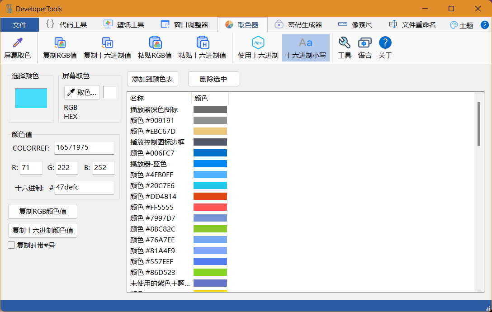

# DeveloperTools
一些小工具集合。

使用Qt开发，支持跨平台。

Windows下使用 Visual Studio 2022 + Qt VS Tools 开发，Qt 版本：5.15.2。

Linux下使用QtCreator开发。

支持模块扩展。

目前集成了以下模块：

| 模块名     | 语言 | 使用的框架 |
| ---------- | ---- | ---------- |
| 代码工具   | C++  | Qt         |
| 壁纸工具   | C++  | Qt         |
| 窗口调整器 | C++  | MFC        |
| 取色器     | C++  | MFC        |
| 密码生成器 | C#   | WinForm    |
| 像素尺     | C++  | Qt         |
| 文件重命名 | C++  | Qt         |

其中窗口调整器、取色器和密码生成器是我以前开发的小工具，也可以单独运行。

## 界面框架

界面框架使用Qt编写，实现了Ribbon风格界面，通过`MainFrame.xml`文件配置Ribbon标签中的元素以及加载的模块。

界面框架的说明和源代码请参见此版本库：

[zhongyang219/RibbonUiFrame: 这是一个界面框架模块，实现了Ribbon风格的样式，使用xml文件配置Ribbon标签页。此框架可以将Qt或MFC/Win32程序集成到同一个应用程序中。 (github.com)](https://github.com/zhongyang219/RibbonUiFrame/)

界面框架采用动态库的形式保存在本项目中，如果使用的Qt版本与本项目不同，请从以上版本库拉取界面框架的源代码后自行编译生成`RibbonFrame.dll`和`StylePlugin.dll`文件。

## 代码工具

代码工具具有批量删除代码注释和添加代码头的功能。

### 添加文件

* 在“设置扫描路径”下方的文本框右侧点击“浏览”按钮选择一个扫描文件。

* 在扫描文件的格式下拉框中输入要扫描文件格式，多种格式使用半角分号分隔。

* 点击Ribbon栏中的“扫描文件”按钮，此时符合条件的文件会在“文件列表”中显示出来。
* 列表右侧的“添加”、“移除”、“清空”可以对列表中的文件进行操作。

### 批量删除注释

将要操作的文件添加到列表后，可以通过Ribbon栏中设置相关的选项，如下图所示：

选中“删除注释”可以删除代码中的注释。

选中“移除多余的空格”可以删除每行代码末尾的空格。

选中“移除多余的空白行”可以将代码中多余的空行删除，可以在右侧的下拉列表中选择需要保留的连续空白行数。

点击“执行”工具即可根据设置的选项批量处理列表中的文件。

### 添加代码头

选中Ribbon栏中的“添加加代码头”按钮后，窗口右侧会显示添加代码头的界面。

将要操作的文件添加到左侧列表中后，在添加代码头列表中勾选要添加到代码头中的内容，点击Ribbon栏中“添加代码头”右侧的“执行”按钮即可为列表中的文件批量添加代码头。

## 壁纸工具

此工具的作用是，当你将桌面壁纸设置为“幻灯片播放”并且你的壁纸文件夹下有很多图片时，它可以告诉你当前显示的是哪片图片，并且可以将当前图片保存到指定目录。

目前实现了显示当前壁纸，当前壁纸另存为，删除当前壁纸的功能。

## 窗口调整器

这是一个用于调整窗口大小的软件，具有以去除窗口的边框、强制最大化等功能。源代码和说明请参见以下版本库：

[zhongyang219/WindowResizer: 这是一个用于调整窗口大小的软件，这对于那些无法调整大小的窗口尤其有用。 (github.com)](https://github.com/zhongyang219/WindowResizer)

如果需要将WindowResizer作为一个模块加载到DevelperTools中，拉取WindowResizer后，请在Visual Studio菜单栏选择“项目”>“属性”，选择“常规”，将“配置类型”由“应用程序(.exe)”改成“动态库(.dll)”，编译生成dll文件后即可被DevelperTools加载。

## 取色器

取色器是一个取色工具，源代码和说明请参见以下版本库：

[zhongyang219/ColorPicker: 这是一个简单的取色软件 (github.com)](https://github.com/zhongyang219/ColorPicker)

要将ColorPicker作为一个模块加载到DevelperTools中，同样需要在Visual Studio菜单栏选择“项目”>“属性”，选择“常规”，将“配置类型”由“应用程序(.exe)”改成“动态库(.dll)”。

## 密码生成器

这是一个用于生成随机密码的小工具，源代码和说明请参见以下版本库：

[zhongyang219/PasswordGenerator: 这是一个用于生成一个随机字符串的小工具。 (github.com)](https://github.com/zhongyang219/PasswordGenerator)

## 像素尺

像素尺是一个用于测量屏幕上元素像素值的小工具。

点击Ribbon栏中的“显示水平标尺”和“显示垂直标尺”按钮可以在屏上显示一个可自由拖动的标尺。

### 设置缩放比例

* 勾选Ribbon菜单中的“系统缩放比例”可以使像素尺的刻度按照当前系统DPI设置放大。
* 不勾选“系统缩放比例”时可以在“自定义比例”下拉列表中选择一个缩放比例，默认为100%。

如果你希望在不同dpi设置的电脑上测量同一界面元素时得到相同的测量结果，那么你应该勾选“系统缩放比例”，使得像素尺的刻度会跟随系统DPI设置而缩放。

### 设置标尺最小刻度

点击Ribbon菜单中“标尺最小刻度”组中的单选框可以设置标尺最小刻度。

### 显示屏标尺

点击Ribbon菜单中的“显示水平标尺”或“显示垂直标尺”可以显示一个屏幕标尺，你可以将屏幕标尺拖动到需要测量的地方。

当屏幕标尺处于激活状态时，可以通过键盘上的上下左右方向键以1像素为单位移动屏幕标尺的位置。

## 文件重命名

这是一个简单的文件重命名工具，实现了使用修改时间重命名、使用数字编辑重命名和替换功能。

点击Ribbon栏中的“添加文件”或“添加文件夹”按钮可以将要操作的文件添加到文件列表中。也可以直接将文件或文件夹拖放到窗口中。

在“重命名选项”中可以设置重命名模式。

* 勾选“添加前缀”后可以设置重命名时在文件名前面添加的字符串。

* 勾选“自动解决命名冲突”时，如果重命名时目标文件已经存在，则会自动使用新的文件名，新文件的命名规则为：如果文件名不是以“(数字)”的格式结尾，则会在文件名末尾加上“(1)”；如果文件名是以“(数字)”的格式结尾，则将括号内的数字加1。

设置好选项后点击Ribbon栏中的“执行”按钮可以对列表中的文件进行重命名。

### 使用修改时间重命名

选择“使用修改时间重命名”时，会根据文件名的修改时间重命名。

### 使用数字编号重命名

选择“使用数字编号重命名”时，可以设置数字的起始值和数字的位数。

### 替换

选择“替换”时，在文本框中填入替换前和替换后的文本，点击“执行”即可完成替换。

此功能不区分大小写。
